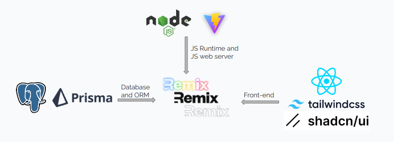
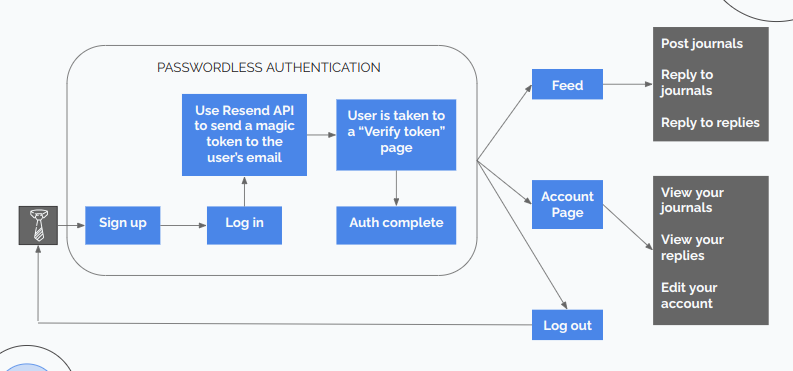
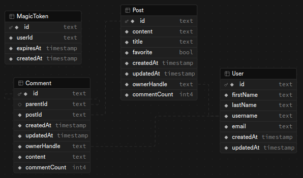

# Welcome to Noteworthy - a Remix social media app

<p align="center">
  
</p>

## Description

Noteworthy is a minimum viable product (MVP) for a social media app built with
a focus on journaling. It aims to create a safe and supportive space for users
to express themselves, share their experiences, and connect with others
through the power of journaling.

## Table of Contents

- [Installation](#installation)
- [Development](#development)
- [Deployment](#deployment)
- [Contributing](#contributing)
- [Contact](#contact)

## Installation

Clone this repo:

```shell
git clone https://github.com/Abdorithm/Noteworthy.git
```

Install dependencies:

```shell
npm install
```

## Development

### Built with Remix

This project leverages the power of Remix, a full-stack web framework.
Remix offered several key advantages during development:

1. **Simplified Data Fetching**: Remix's loader and action functions
   streamlined data fetching significantly. Loaders are ideal for fetching data
   before rendering a page, ensuring a more dynamic and responsive user
   experience. Actions, on the other hand, handle form submissions and other
   user interactions, providing a seamless way to update data and trigger
   server-side actions.

2. **Server-Side Rendering (SSR)**: By leveraging SSR, a faster initial
   page load for users is ensured.

3. **Full-Stack Focus**: Remix's full-stack approach provided a unified
   development environment, streamlining the development process for both
   frontend and backend components.

**To run the dev server**:

```shell
npm run dev
```

### Teck stack

<p align="center">
  
</p>

### MVP Architecture

#### Passwords are boring

One of the core aspects I was particularly passionate about implementing
was **seamless and secure passwordless authentication.** That way I don't
have to worry about a password reset functionality and the security burden
is on the email provider. A user only provides his username or email upon login.

<p align="center">
  
</p>

### Database Schema

<p align="center">
  
</p>

## Deployment

This project is currently (temporarily) deployed here: [noteworthy.abdorithm.tech](https://noteworthy.abdorithm.tech)

First, build the app for production:

```shell
npm run build
```

Then run the app in production mode:

```shell
npm start
```

Now you'll need to pick a host to deploy it to.

## Contributing

We welcome contributions to Noteworthy! To ensure a smooth process,
please follow these guidelines:

### How to Contribute

1. **Fork the Repository**: Click the "Fork" button at the top right of
   this repository to create a copy of the repository on your GitHub account.

2. **Clone the Forked Repository**: Clone the forked repository to your local machine.

   ```shell
   git clone https://github.com/your-username/Noteworthy.git
   cd Noteworthy
   ```

3. **Create a Branch**: Create a new branch for your feature or bugfix.

   ```shell
   git checkout -b feature/your-feature-name
   ```

4. **Make Changes**: Make your changes in the codebase.

5. **Commit Changes**: Commit your changes with a clear and descriptive commit message.

   ```shell
   git add .
   git commit -m "Add feature: your feature description"
   ```

6. **Push to GitHub**: Push your changes to your forked repository.

   ```shell
   git push origin feature/your-feature-name
   ```

7. **Create a Pull Request**: Go to the original repository on GitHub and
   create a pull request from your forked repository. Provide a clear description
   of your changes and why they are necessary.

### Code Style

- Follow the existing code style and conventions.
- Write clear and concise commit messages.
- Ensure your code is well-documented.

### Reporting Issues

- If you find a bug, please create an issue on GitHub with a clear description
  of the problem and steps to reproduce it.
- If you have a feature request, please create an issue with a detailed
  description of the feature and why it would be useful.

Thank you for contributing to Noteworthy!

## Contact

If you have any questions, suggestions, or feedback, feel free to reach out to me:

- **X**: [@Abdorithm](https://x.com/Abdorithm)
- **Discord**: abdorithm

I look forward to hearing from you!
